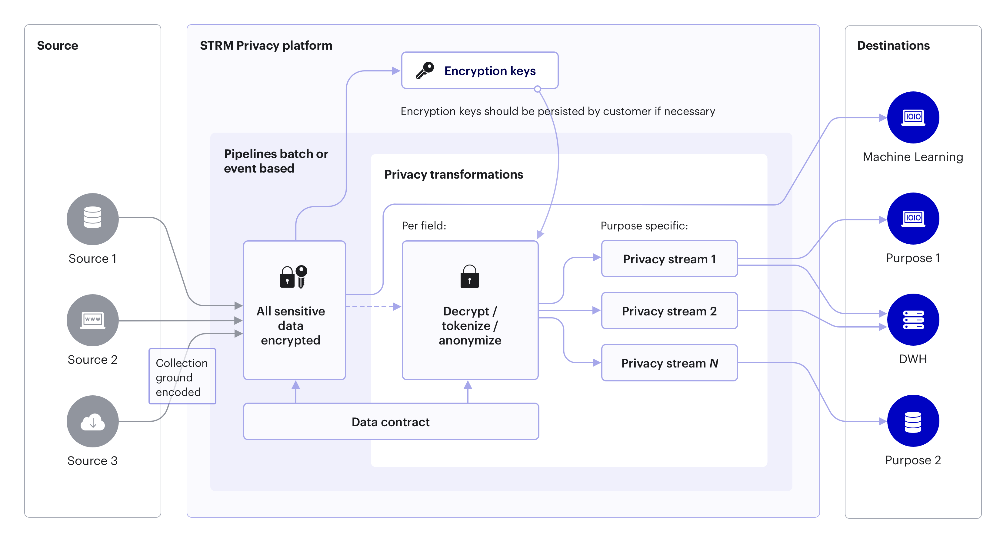

# Architecture

This section shows a high level architecture of STRM Privacy. It shows
how data is processed, before it is exposed to an application consuming
the data.

## Overview {#overview}

When sending data to, or receiving data from STRM Privacy, your
application must identify itself using client credentials. These
credentials are provided through the [Console](https://console.strmprivacy.io) or via the
[`strm` command line interface](https://github.com/strmprivacy/cli).

All events that are sent to STRM Privacy (regardless of [deployment mode](docs/02-concepts/03-deployment-modes/index.md))
have schema reference (provided through an HTTP header) that defines the structure and contents of the event.

The STRM Privacy *Event Gateway* will verify that the data:

1.  ...is of the correct serialization format, as specified in schema
    reference

2.  ...is a valid serialized message

3.  ...complies to the pre-defined validation rules, as specified in the
    Data Contract (the contract reference is embedded in the mandatory [`strmMeta`](docs/02-concepts/02-data-contracts/02-strm-meta.md)
    section of the event)

Upon accepting an event, the *Event Gateway* will use the *Encrypter* to
encrypt **all** defined [Personal data and PII](./02-pii.md)
attributes of the event. Which fields are personal data is defined in the [data
contract](docs/02-concepts/02-data-contracts/index.md). The
schema can have multiple levels of Personal Data attributes but all of them are
encrypted with the same encryption key that is linked to the [`keyField`](docs/02-concepts/02-data-contracts/index.md#contracts).

You can create decrypted streams that contain a subset of the
encrypted stream (more specifically, **only** the events of [data subjects](docs/02-concepts/02-data-contracts/04-data-subjects.md)
that provided consent for the desired purposes), with only those Personal Data
fields decrypted that you have requested. It is **not** required to create decrypted streams. 

The algorithm is as follows:

-   we define a derived stream where for example we request to receive
    events that provide a processing basis for levels 1, 3 and 8.

-   the decrypter will inspect every event, and will ignore all events
    that don’t have *at least* these 3 levels set in the
    [`strmMeta.consentLevels`](docs/02-concepts/02-data-contracts/02-strm-meta.md).

-   the events that are accepted by the decrypter will then be partially
    decrypted; only the encrypted data fields with Personal Data levels 1, 3 and 8 will be
    decrypted. This means that assuming a data subject has given consent for
    a couple more Personal Data levels, fields with those purpose levels will
    **not be decrypted**. This is the mechanism that STRM Privacy uses
    to adhere to [article 6 of the
    GDPR](https://eur-lex.europa.eu/legal-content/EN/TXT/HTML/?uri=CELEX:32016R0679&qid=1620048611044&from=EN#d1e1888-1-1).
    A data processing unit in a company receives only those events that the data subject has consented
    to, with only those Personal Data attributes it needs.

## Outputs

STRM Privacy provides multiple ways to output data. Read more on exporting data [here](docs/03-quickstart/01-streaming/04-receiving-data/index.md).
