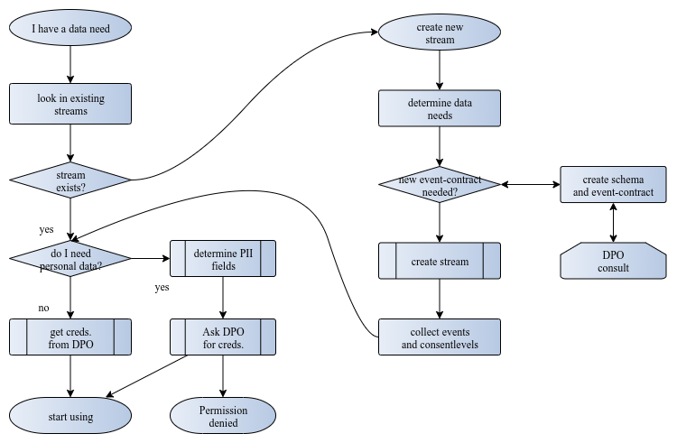

[//]: # (TODO write this page)

## Using the encrypted data.

The primary event stream is called the *encrypted stream* and this by
design no longer contains PII data. **Everyone** in your company can use
it [^3]. In case these data become compromised, you have a business
issue, but **not** a privacy issue.

Even these data are useful. With a typical clickstream, where `url` is
not considered personal data, you could identify dead ends on your site,
or train recommender engines on the encrypted stream, because the
attributes that identify the sequence even though encrypted, remain *the
same* for 24 hours. This is plenty long enough to understand typical
customer journeys, without compromising the privacy of your users.

### Using the decrypted data.

If your usecase requires specific permissions, the process is as
follows:

### Identify the consent levels you need.

Ask the [Data Protection Officer](https://edps.europa.eu/data-protection/data-protection/reference-library/data-protection-officer-dpo_en) the
specific consent levels your usecase requires. This will return a list
of values [^4] that you need.

### Consent level types

STRM Privacy supports two types of consent levels when creating a
decrypted output stream: granular and cumulative.

1.  Cumulative: Only the highest consent level is configured on the
    output stream. All consent levels from zero (included) up to this
    level (included) are decrypted in the output stream.

2.  Granular: All the consent levels that are to be decrypted in the
    output stream are explicitly configured. This way, it’s possible to
    have "gaps" between the consent levels. For example, can specify
    level 1 and 4, which means that all other levels, including 2 and 3
    remain encrypted.

The resulting set of consent levels effects two things, see:
[Create a decrypted stream](#create-a-decrypted-stream)

### Create a decrypted stream {#create-a-decrypted-stream}

Here you instruct STRM Privacy to decrypt event data with above consent
levels. STRM Privacy will

-   drop all events that don’t at least contain all the consent levels
    you require.

-   decrypt attributes with the consent levels you requested. Attributes
    with other pii levels will not be decrypted. So you receive exactly
    what you have a right to, and nothing more.

You access this stream with a specific set of credentials.

This means that data consumers will only receive the data they are
legally allowed to receive, provided the company is careful with ***not
re-using credentials***.

## Getting the data into STRM Privacy

STRM Privacy is currently an engine running on Google Cloud, with http/2
input. In order to have data accepted by STRM Privacy you need the
following:

-   a valid account

-   a stream definition, with associated credentials. STRM Privacy
    currently uses the Oauth 2.0 client credentials scheme.

-   an http/http2 client that sends data in the correct format. We
    provide *drivers* for various languages [^5] that simplify creating
    the events and sending the data. For maximum performance, http/2 is
    preferred over http1.1. You can find the drivers on
    [github.com/strmprivacy](https://github.com/strmprivacy) You don’t
    *need* our software to send data.
    [Here](/03-quickstart/01-streaming/03-sending-data/02-sending-curl.md) you can play with the actual
    http interaction.

## Getting data out of STRM Privacy

STRM Privacy internally keeps its data in [Apache
Kafka](https://kafka.apache.org/) topics, that typically auto-expire
their data in 7 days.

For getting the data into your systems we currently have the following
options.

### Batch exports

Currently, we have the option to do periodic (minute scale) exports to
for example AWS S3 and Google Cloud buckets, in Json-lines format [^6]. This is a
very common format for Data Scientists.

### Kafka consumers

We provide the option to create an internet accessible [^7] Kafka cluster
where you can use standard Kafka consumers to retrieve your data [^8].

[^1]: possibly plus internet roundtrip time

[^3]: at least from a GDPR perspective

[^4]: small integers

[^5]: currently Java, Javascript and Python

[^6]: even when the primary format is Avro

[^7]: authorized ofcourse

[^8]: in Json format for now
