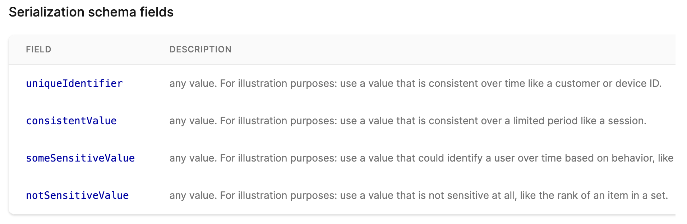
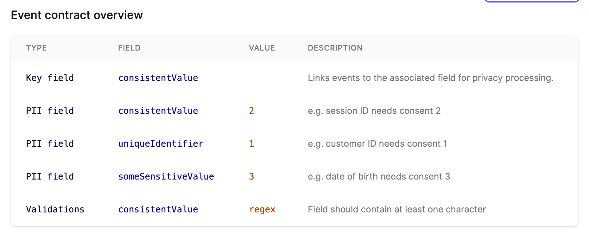
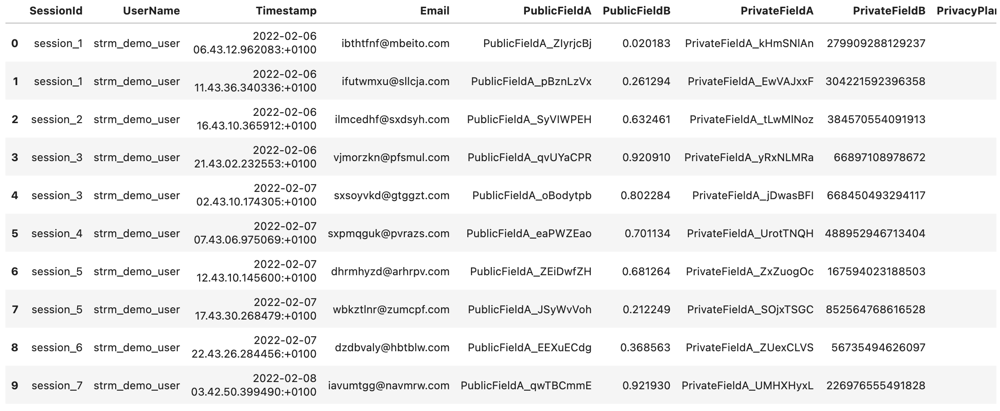
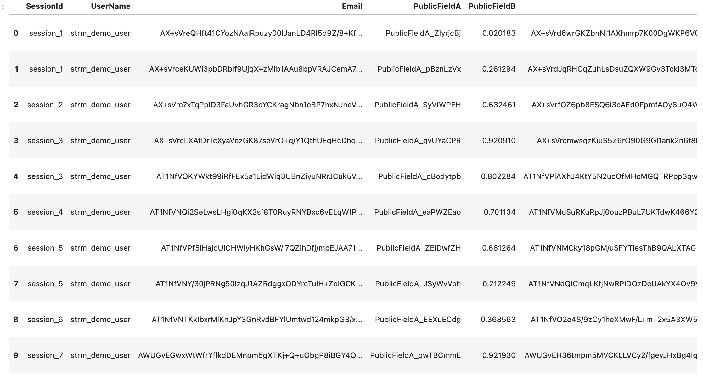
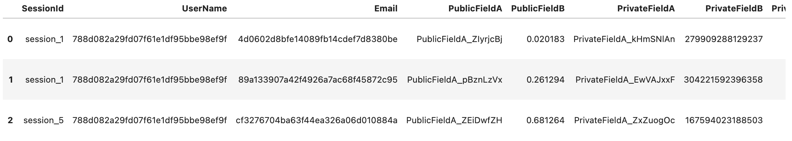

[notebook]: https://github.com/strmprivacy/demos/blob/main/strm_batch_mode_demo.ipynb

We're expanding our platform with support for batch processing. Read along, jump right to the [the example
notebook][notebook] or read more about the [background for batch pipelines](/02-concepts/01-data-processing/02-batch-jobs.md).

## Create a STRM batch mode pipeline

With batch mode, you can set up data routines that, based on the data contract, grab data from (currently) a bucket,
transform according to a data contract and subsequently pick it up for downstream processing.

This is a powerful way to quickly set up data pipelines to feed applications that process or need sensitive data in
batch routines without the overhead. In the real-world this means you align on the privacy implications with your
security and/or legal counterparts first, and because privacy comes by design and is encoded into the pipeline AND data
itself, you can just go ahead and build a bunch.

This saves you a lot of trips to legal desks, and so improves your quality of life considerably.

(we're joking - it just means you can build faster).

### On the menu
These are the steps we will walk through today:

- Create a data connection to retrieve and store the data
- Define the data contract your data adheres to.
- Define a batch job in the CLI
- Generate some data for demo purposes
- Explore the transformed data for downstream consumption

Let's go!

## Creating a data connector
First create a [data-connector](docs/03-quickstart/03-data-connectors/index.md) of the desired kind.


### Define the data contract

The next step is to instruct us what your data looks like. This is done in the _data contract_, which combines the data
shape (your fields) with the privacy implications.

These are the shape and classification for the [privacy demo event
contract](https://strmprivacy.io/schemas/strmprivacy/example/1.3.0/):

_Data shape_


_Data classification_


You can use an existing data contract or create your own. Refer to this blog on [creating data
contracts](https://strmprivacy.io/posts/add-your-own-schemas/). We also offer what we call [Simple
Schemas](https://strmprivacy.io/posts/simple-data-schemas/), a much easier way to define your data shape than the
underlying AVRO serialization schema.

### Define a batch job in the CLI.

With the data connection and contract defined, we can now define the batch job itself.

In this early release this is done by providing a config JSON through our CLI:

```bash
❯ strm create batch-job --help
Create a Batch Job

Usage:
  strm create batch-job [flags]

Flags:
  -F, --file stringThe path to the JSON file containing the batch job configuration
  -h, --help help for batch-job
```

The JSON simply details which data-connector to use, what contract to apply and how to write the data back. We are
working to include GCP Storage, a visual interface and even a file upload in follow-on releases.

#### Indicate the consent field

An important part of the definition file is the consent mapping.

In streaming mode, you simply send us the consent (legal ground under which the data was collected) as part of every event.

For batch mode you need to indicate which field in your data actually contains the legal ground per row.

In the definition file you need to set these three values:

- what the default legal ground (consent level) is.
- the field that contains the legal ground in your data and
- what each of these fields mean (a mapping of name to integer values)

About the default consent: It's safest to keep this to int 0. It just means the data was collected under the most basic
consent or legal ground you use.

```json5
{
  // partial excerpt
  "consent": {
    "default_consent_levels": [ 0 ],
    "consent_level_extractor": {
      "field": "the field that indicates collection ground",
      "field_patterns": {
        "example, like legitimate interest": {
          "consent_levels": [ 1 ]
        },
        "example, like marketing": {
          "consent_levels": [ 2 ]
        }
      }
    }
  }
  // partial excerpt
}
```

[An example of the full definition file is included in the demo
notebook][notebook]. Just swap the example values for
your own billing_id, data-connector names and preferred buckets.

### Define the derived data

The next step is to define the derived data - the privacy-transformed output. Just think of this as a folder on a disk
that contains data that is ready for a specific purpose (like, in the example below, training a recommender).

First, let's dive a bit deeper into how we transform. For reasons of the tutorial, we'll focus on a specific derived
stream - in real-world applications you would probably have many different consent levels (the legal ground under which
data is collected) and so a bunch of different derived streams.

#### Intermezzo: Privacy-transforming your data
Based on the event-contract, we process and transform the data in your batches. The level of privacy we can achieve
depends on the format of your source data.

Let us explain:

We use the temporal dimension in data to achieve a fast but powerful way to apply the necessary transformations (through
the `keyField` in the event contract) through encryption. It is therefore important to understand that data is
pseudonimized at best unless you have multiple rows per user that are closely spaced in time (like separated clicks or
url hits with context data).

We plan to extend the privacy transforms soon, but as we expand into batch mode from streaming mode (where you usually
have separate but closely spaced data points - e.g. events over multiple days) this is currently an important
limitation.

So are you planning to use batch mode for e.g. user profile info, where every row is just one user? That won't get you
anonymized data currently!

#### A real-world case for derived data: masking for recommenders
Back to a real-world case. Imagine you have a batch job with clickstream data you plan to use to train or evaluate a recommender system.

Your data includes a pii field that you do not want or are not allowed to reveal, while you do need it for your data
analysis. Recommendations are highly personal and therefore require linking previous behaviour (orders, movies etc.) to
the same user.

The only "personality dimension" a basic recommender really needs is to know what was the same user. They do not
necessarily need to know who was the underlying customer. This is where masking comes in.

By masking a field, we replace the actual value (e.g. the customer id) with a hash, allowing to link multiple data
points to a single user, without revealing personal information. This can be done with derived streams.

In the snippet below, you will find the `derived_data` configuration of the batch-job. This configuration shows the
data-connector to read _from_, the file to write _to_ and the allowed consent levels and consent type of the data like
before. Finally, the snippet also shows the `masked_fields`. Within the event-contract block
`"databert-handle/batch_job_public/1.0.1"{ ... }` you can find the column names or `field_patterns` of the fields to
mask.

```json
{
  // partial excerpt
  "derived_data": [
    {
      "target": {
        "data_connector_ref": {
          "billing_id": "your_billing_id",
          "name": "databert-demo"
        },
        "data_type": {
          "csv": {
            "charset": "UTF-8"
          }
        },
        "file_name": "databert-demo-derived.csv"
      },
      "consent_levels": [
        2
      ],
      "consent_level_type": "CUMULATIVE",
      "masked_fields": {
        "field_patterns": {
          "databert-handle/batch_job_public/1.0.0": {
            "field_patterns": [
              "Email",
              "UserName"
            ]
          }
        }
      }
    }
  ]
  // partial excerpt
}
```

### Generate the batch data

In a batch job, data is read, transformed and returned as soon as new files are found inside the bucket.

To simulate a data routine you already have or plan to set up, the [example notebook][notebook] includes a
`DataGenerator` class that simulates some random user data (when we say random, we really mean "non-sensical").  Apart
from session, user and meta (like a timestamp) fields you will recognize the `PrivacyPlane` as the consent field in step
3.1 above.

Clone/fork/download the notebook and add/replace your own `billing_id` and credentials in the `AwsProperties()` class
and `s3.json` to quickly prepare a demo pipeline of your own.

### Explore privacy-transformed data

We have now defined the data shape and privacy implications (the `data contract`), defined the `batch job`, created a
`derived stream` with masking applied, and generated some example data.

Let's explore what happens to the data based on (1) the event contract and (2) derived stream we defined.

#### Input data
The input data coming from the `DataGenerator` class that acts as input won't surprise you:



#### 6.2 Encrypted data
The next step is to look at the data that is just encrypted (per field!).

Basically, all connections that might exist between rows are destroyed here: we see the pii-fields `Email`,
`PrivateFieldA` and `PrivateFieldB`, set in our event contract, are encrypted.



#### Derived Data
It becomes more interesting when we take a look at the derived data (as we defined the derived stream above). Remember,
the goal was to apply masking instead of destroying any connection between rows that might exist.

Per the event contract, the derived data is allowed to contain entries with a consent level of 2 or higher. From the
input data we know that there are 3 entries with a consent level of 2, which correspond to the three outputs below. In
the table you can also see that the values for `UserName` and `Email` are hashed. This corresponds to the
`field_patterns` that we have set in de `masked_fields` section of the event contract for `derived_data`. The username
has been masked, but the hashed username is consistent over all rows. The `Email` field is different for every entry and
therefore the hashed field is too.



### Example notebook
To quickly see for yourself how Batch Mode works, copy or clone the example notebook from Github with your own S3 and
STRM credentials and explore the data. It also includes the batch job definition file.

[Get it][notebook]

### In sum: STRM Batch mode

So, to illustrate how to create batch jobs with privacy transformations, we took the following steps:

- We created a data connection to retrieve and store the data
- Defined the data contract your data adheres to.
- We defined a batch job in the CLI
- Generated some data for demo purposes
- Explore the transformed data for downstream consumption

[Sign-up](https://accounts.strmprivacy.io/auth/realms/users/protocol/openid-connect/registrations?client_id=console&response_type=code&scope=openid%20email&redirect_uri=https://console.strmprivacy.io/) to try if for yourself and let us know how we can help you!

