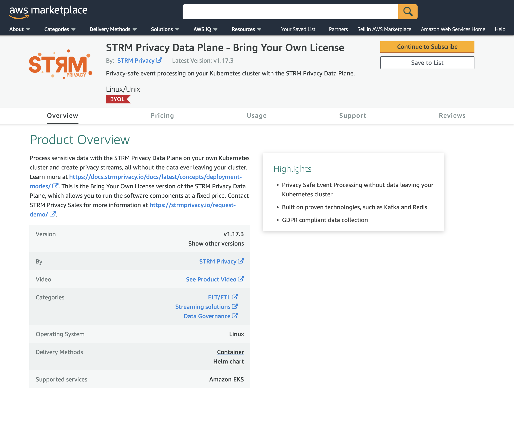

This section describes how to get up and running with a Customer Cloud Deployment through the AWS Marketplace.

## Step 1: Follow along with the general steps for Customer Cloud Deployment

Before you can launch your AWS Marketplace STRM Privacy - Bring Your Own License Installation, you need to follow along
with [step 1](docs/03-quickstart/05-ccd/01-pre-requisites.md#step1)
and [step 2](docs/03-quickstart/05-ccd/01-pre-requisites.md#step2)
from the pre-requisites section.

Additionally, to the tools mentioned in [step 2](docs/03-quickstart/05-ccd/01-pre-requisites.md#step2), you'll need to
install:

* [`eksctl`](https://eksctl.io/): a CLI to easily manage EKS clusters (unifies a lot of `aws` CLI and `kubectl`
  commands).

## Step 2: Setup a Kubernetes cluster with AWS EKS

One of the pre-requisites for the STRM Privacy Data Plane is an operational Kubernetes cluster. If you don't have an EKS
cluster yet, please follow the instructions on how to setup an EKS cluster in
the [AWS EKS getting started guide](https://docs.aws.amazon.com/eks/latest/userguide/create-cluster.html).

:::important
Ensure that the EKS cluster you create, is <u>**not**</u> a Fargate EKS cluster as that is not supported by the Data
Plane.
:::

## Step 3: Setup your STRM Privacy Data Plane

Navigate to the [STRM Privacy AWS Marketplace](https://aws.amazon.com/marketplace/pp/prodview-2ekyuezbwmiak) listing and
follow the following steps.



1. **Subscribe**  
   Click `Continue to Subscribe`, and then `Accept license` to start your subscription. **Don't** click `Continue to the Configuration`, but follow along with the steps below.
   :::important
   The installation instructions in the AWS Marketplace after subscribing are quite unclear, as many details are left
   out.
   Please follow along with this guide to help you setup your Data Plane via the AWS Marketplace
   :::

2. **Install the** [](https://github.com/strmprivacy/data-plane-helm-chart)  
   Run the following commands shown in the script below. If you are working with different AWS profiles, don't forget to
   add the `--profile your_profile` flag to the `aws` command below.
  
   ```shell showLineNumbers placeholders version=https://api.github.com/repos/strmprivacy/data-plane-helm-chart/releases/latest#name, installationId=Installation ID, clientId=Client ID of your installation, clientSecret=Client Secret of your installation
   # Enables using Helm Charts in Open Container Image format
   export HELM_EXPERIMENTAL_OCI=1
   
   # Region us-east-1 is required as the AWS Marketplace ECR registries are located there
   aws ecr get-login-password \
   --region us-east-1 | helm registry login \
   --username AWS \
   --password-stdin 709825985650.dkr.ecr.us-east-1.amazonaws.com
   
   # Create a temporary working directory to download the chart to and install it
   mkdir awsmp-chart && cd awsmp-chart
   
   # Pull the latest Helm Chart Version: $version
   helm pull oci://709825985650.dkr.ecr.us-east-1.amazonaws.com/strm-privacy/strm --version $version
   
   # Untar the chart and remove the tarball
   tar xf $(pwd)/* && find $(pwd) -maxdepth 1 -type f -delete
   
   # Install the chart
   // callout-1
   helm install strmprivacy \
   // callout-2
   --namespace strmprivacy --create-namespace ./* \
   // callout-3
   --set license.installationType=AWS_MARKETPLACE \
   --set license.installationId=$installationId \
   --set license.installationClientId=$clientId \
   --set license.installationClientSecret=$clientSecret
    ```
  Replace the placeholders above with the values that can be found in your
  [installation configuration](https://console.strmprivacy.io/installation/configuration). In the `helm install` command
  above, the following remarks apply:  
   1\. The name of the installed Helm Chart (how the installation will show up in the `helm list` command).  
   2\. The Kubernetes namespace to which the Helm Chart will be installed.  
   3\. The `installationType`, that indicates that this is a AWS Marketplace BYOL installation.  
  
  Feel free to change the value for the name of the Helm Chart (1) and the Kubernetes namespace (2).
3. **Wait until the installation finishes**  
   As by default, the embedded Kafka, Redis, and Postgres Database are included, installation can take a moment. After
   installation, you should end up with a namespace that contains all components that were enabled as specified in the
   `values.yaml` (here [the defaults](https://github.com/strmprivacy/data-plane-helm-chart/blob/master/helm/values.yaml)
   are used, as they're not overridden).


After these steps, you should end up with a namespace `strmprivacy` with, by
default, [all components](docs/03-quickstart/05-ccd/index.md#components) enabled. If you
wish otherwise, you can edit the `values.yaml` to match your needs.

:::important
Even though the example above uses `--set` in the `helm install` command, prefer using a `values.yaml`. More details
can be found [here](./03-advanced.md#using-a-valuesyaml).
:::

## Wrap-up

You've installed a STRM Privacy Data Plane via the AWS Marketplace. If you have had any issues during your
installation, please let us know, or create a pull request on GitHub to improve these docs.

Now that you are done with the setup, follow the docs
on [how to interact with your cluster](docs/03-quickstart/05-ccd/04-interacting.md) to start
using it.
