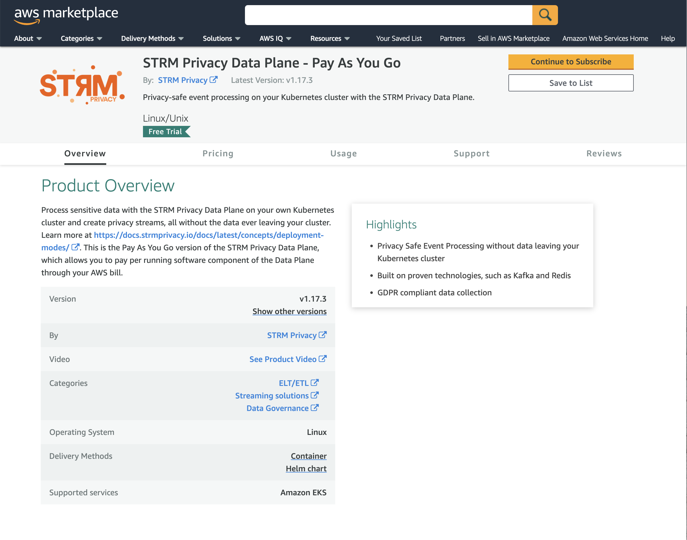

This section describes how to get up and running with a Customer Cloud Deployment through the AWS Marketplace.

:::tip
Try out the STRM Privacy - Pay As You Go AWS Marketplace Installation for free for 7 days, with 10 containers.
See the [pricing](#pricing) section for more details.
:::

## Step 1: Follow along with the general steps for Customer Cloud Deployment

Before you can launch your AWS Marketplace STRM Privacy - Pay As You Go Installation, you need to follow along
with [step 1](docs/03-quickstart/05-ccd/01-pre-requisites.md#step1)
and [step 2](docs/03-quickstart/05-ccd/01-pre-requisites.md#step2)
from the pre-requisites section.

Additionally, to the tools mentioned in [step 2](docs/03-quickstart/05-ccd/01-pre-requisites.md#step2), you'll need to
install:

* [`eksctl`](https://eksctl.io/): a CLI to easily manage EKS clusters (unifies a lot of `aws` CLI and `kubectl`
  commands).

## Step 2: Setup a Kubernetes cluster with AWS EKS

One of the pre-requisites for the STRM Privacy Data Plane is an operational Kubernetes cluster. If you don't have an EKS
cluster yet, please follow the instructions on how to setup an EKS cluster in
the [AWS EKS getting started guide](https://docs.aws.amazon.com/eks/latest/userguide/create-cluster.html).

:::important
Ensure that the EKS cluster you create, is <u>**not**</u> a Fargate EKS cluster as that is not supported by the Data
Plane.
:::

## Step 3: Setup your STRM Privacy Data Plane

Navigate to the [STRM Privacy AWS Marketplace](https://aws.amazon.com/marketplace/pp/prodview-o3kfnl2luctxe) listing and
follow the following steps.



:::tip
If you are working with different AWS profiles, don't forget to
add the `--profile your_profile` flag to the `aws` commands in the code blocks below.
:::

1. **Subscribe**  
   Click `Continue to Subscribe`, follow the instructions and start your subscription. Come back to this guide after
   you've finished subscribing.
   :::important
   The installation instructions in the AWS Marketplace after subscribing are quite unclear, as many details are left
   out.
   Please follow along with this guide to help you setup your Data Plane via the AWS Marketplace
   :::
2. **Create an OIDC provider**  
   If your EKS cluster does not have an OIDC provider, one needs to be created. This is a requirement, as it is needed
   for applications to call AWS Services on your behalf. This is limited to the services defined in a role by you in
   this guide.
   ```bash placeholders cluster=EKS Cluster Name, region=EKS Cluster Region
    oidc_id=$(aws eks describe-cluster --name $cluster --query "cluster.identity.oidc.issuer" --output text --region $region | cut -d '/' -f 5)

    # Check if already present in account, if this returns nothing, proceed with the associate step
    # otherwise, an OIDC provider is already associated and this can be skipped
    aws iam list-open-id-connect-providers --region $region | grep $oidc_id

    # Associate the cluster with the OIDC provider
    $ eksctl utils associate-iam-oidc-provider --cluster $cluster --region $region --approve
   ```
3. **Create AWS Marketplace Metering Role**  
   In order for the STRM Privacy Data Plane applications to bill via your AWS invoice, the applications need to be able
   to call the AWS Marketplace Metering API. Therefore, a role needs to be created that allows web identities that have
   authenticated via the OIDC provider, to assume this role.
   1. Create an assume role policy document. Fill out the placeholders below and download the file.
      :::tip
      Get the OIDC ID with the oneliner used in the previous step.
      :::
      :::tip
      Get your AWS account id with this oneliner:
      ```
      aws sts get-caller-identity --query "Account" --output text
      ```
      :::
      ```json title=strmprivacy-marketplace-role.json download=strmprivacy-marketplace-role.json placeholders account_id=AWS (EKS) Account ID, region=EKS Region, oidc_id=OIDC ID, namespace=Kubernetes Namespace for STRM Privacy
      {
        "Version": "2012-10-17",
        "Statement": [
          {
            "Effect": "Allow",
            "Principal": {
              "Federated": "arn:aws:iam::$account_id:oidc-provider/oidc.eks.$region.amazonaws.com/id/$oidc_id"
            },
            "Action": "sts:AssumeRoleWithWebIdentity",
            "Condition": {
              "StringLike": {
                "oidc.eks.$region.amazonaws.com/id/$oidc_id:sub": "system:serviceaccount:$namespace:*"
              }
            }
          }
        ]
      }
      ```
   2. Create the role.
      ```shell placeholders role_name=Name of the role
      aws iam create-role --role-name $role_name --assume-role-policy-document "file:///path/to/strmprivacy-marketplace-role.json"
      ```
   3. Attach the `AWSMarketplaceMeteringRegisterUsage` predefined policy by AWS
      ```shell placeholders role_name=Name of the role
      aws iam attach-role-policy --policy-arn arn:aws:iam::aws:policy/AWSMarketplaceMeteringRegisterUsage --role-name $role_name
      ```
   4. Get the Role ARN:
      ```shell placeholders role_name=Name of the role
      aws iam get-role --role-name $role_name | jq -r '.Role.Arn'
      ```
2. **Install
   the** [](https://github.com/strmprivacy/data-plane-helm-chart)  
   Run the following commands shown in the script below.
   ```shell showLineNumbers placeholders version=https://api.github.com/repos/strmprivacy/data-plane-helm-chart/releases/latest#name, installation_id=Installation ID, client_id=Client ID of your installation, client_secret=Client Secret of your installation, role_arn=ARN of the role created in the previous step, namespace=Kubernetes Namespace
   # Enables using Helm Charts in Open Container Image format
   export HELM_EXPERIMENTAL_OCI=1
   
   # Region us-east-1 is required as the AWS Marketplace ECR registries are located there
   aws ecr get-login-password \
   --region us-east-1 | helm registry login \
   --username AWS \
   --password-stdin 709825985650.dkr.ecr.us-east-1.amazonaws.com
   
   # Create a temporary working directory to download the chart to and install it
   mkdir awsmp-chart && cd awsmp-chart
   
   # Pull the latest Helm Chart Version: $version
   helm pull oci://709825985650.dkr.ecr.us-east-1.amazonaws.com/strm-privacy/strm-payg --version $version
   
   # Untar the chart and remove the tarball
   tar xf $(pwd)/* && find $(pwd) -maxdepth 1 -type f -delete
   
   # Create the namespace
   kubectl create namespace $namespace
   
   # Install the chart
   // callout-1
   helm install strmprivacy \
   // callout-2
   --namespace $namespace ./* \
   // callout-3
   --set license.installationType=AWS_MARKETPLACE_PAYG \
   --set license.installationId=$installation_id \
   --set license.installationClientId=$client_id \
   --set license.installationClientSecret=$client_secret \
   --set marketplace.aws.serviceAccountRoleArn="$role_arn"
    ```
   Replace the placeholders above with the values that can be found in your
   [installation configuration](https://console.strmprivacy.io/installation/configuration). In the `helm install`
   command
   above, the following remarks apply:  
   1\. The name of the installed Helm Chart (how the installation will show up in the `helm list` command).  
   2\. The Kubernetes namespace to which the Helm Chart will be installed.  
   3\. The `installationType`, that indicates that this is a AWS Marketplace BYOL installation.

   Feel free to change the value for the name of the Helm Chart (1) and the Kubernetes namespace (2).
3. **Wait until the installation finishes**  
   As by default, the embedded Kafka, Redis, and Postgres Database are included, installation can take a moment. After
   installation, you should end up with a namespace that contains all components that were enabled as specified in the
   `values.yaml` (here [the defaults](https://github.com/strmprivacy/data-plane-helm-chart/blob/master/helm/values.yaml)
   are used, as they're not overridden).

After these steps, you should end up with a namespace `strmprivacy` with, by
default, [all components](docs/03-quickstart/05-ccd/index.md#components) enabled. If you
wish otherwise, you can edit the `values.yaml` to match your needs.

:::important
Even though the example above uses `--set` in the `helm install` command, prefer using a `values.yaml`. More details
can be found [here](./03-advanced.md#using-a-valuesyaml).
:::

## Troubleshooting

The metering process in the AWS Marketplace is quite complex, and errors can occur. Here are some issues that can be
encountered while setting up the STRM Privacy Data Plane - Pay As You Go variant:

- **Missing policy**: attach the policy `AWSMarketplaceMeteringRegisterUsage` to the role created for the Data Plane. 
  ```
  User: arn:aws:sts::<account_id>:assumed-role/... is not authorized to perform: aws-marketplace:RegisterUsage because
  no identity-based policy allows the aws-marketplace:RegisterUsage action (Service: MarketplaceMetering,
  Status Code: 400, Request ID: <uuid>)
  ```

Issue not listed here? Please [contact us](docs/05-contact/index.md) to get support.

## Pricing

With Pay As You Go, you only pay for the containers that are running. If you don't need a component, you can easily
disable it through the `values.yaml`. All running containers have a fixed price per hour of `$0.20`. Therefore, if you'd
run all components in your Data Plane, and would have:
- 1 stream, with 3 derived streams
- 1 batch exporter

The price per hour would be:
- Enabled components (Event Gateway, Web Socket, Batch Jobs Agent, Batch Exporters Agent, Streams Agent): `$1.00`
- 3 derived streams = 1 decrypter: `$0.20`
- 1 batch exporter: `$0.20`

Which is a total of `$1.40` / hour. For more details on pricing, please [contact us](docs/05-contact/index.md).

## Wrap-up

You've installed a STRM Privacy Data Plane via the AWS Marketplace. If you have had any issues during your
installation, please let us know, or create a pull request on GitHub to improve these docs.

Now that you are done with the setup, follow the docs
on [how to interact with your cluster](docs/03-quickstart/05-ccd/04-interacting.md) to start
using it.
