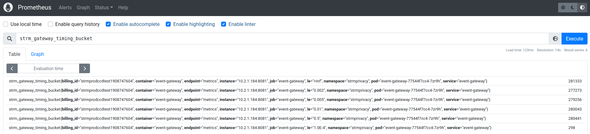

[prometheus]: https://prometheus.io/
[prom-helm]: https://github.com/prometheus-community/helm-charts
[prom-sm]: https://github.com/prometheus-community/helm-charts/blob/main/charts/kube-prometheus-stack/templates/prometheus-operator/servicemonitor.yaml
[telepresence]: https://www.telepresence.io/

## Monitoring the cluster via Prometheus
Most components of STRM Privacy expose [Prometheus][prometheus] metrics and we've included the [Prometheus Cluster
Operator][prom-helm] Helm chart. In order to define _scrape targets_ to Prometheus, we deploy  [Service
Monitors][prom-sm] that expose the metrics endpoints in the Event Gateway.

The `kubectl` commands below assume a default namespace of `strmprivacy`, which you can set via `kubens strmprivacy`
### Prometheus server
Access the Prometheus server either via [telepresence][telepresence] or via a port-forward

    kubectl port-forward service/strmprivacy-kube-prometheu-prometheus 9090:9090&

You should see the Event Gateway in the [service discovery](http://localhost:9090/service-discovery)

* serviceMonitor/strmprivacy/event-gateway-envoy-service-monitor/0
* serviceMonitor/strmprivacy/event-gateway-service-monitor/0

and the [targets](http://localhost:9090/targets)

If you have the simulator running, you could have somewhat interesting timing data:

### Grafana
The CCD quickstart also includes a Grafana instance, that we can port-forward

    kubectl port-forward service/strmprivacy-grafana 4000:80&

Log in to [Grafana](http://localhost:4000/dashboards) with username `admin` and password `prom-operator` (the value of
the secret named `strmprivacy-grafana`).

I've added two panels for the very simple dashboard we show here:

