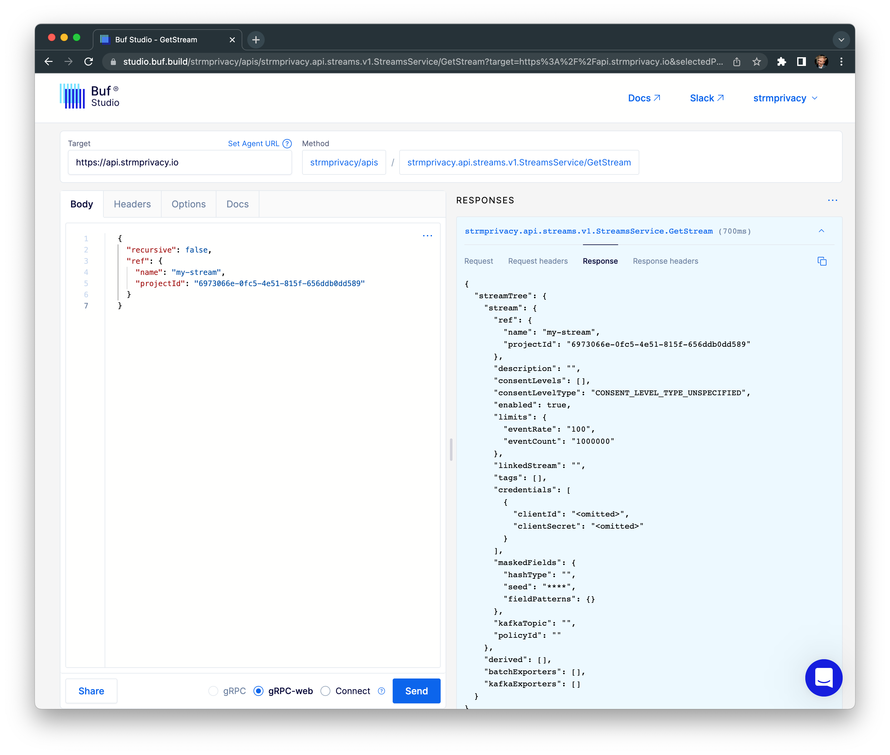

[BSR]: https://studio.buf.build/strmprivacy/apis?serviceDialog=open&target=https%3A%2F%2Fapi.strmprivacy.io&selectedProtocol=grpc-web

As the APIs of STRM Privacy are available through the [BSR (Buf Schema Registry)](https://buf.build/strmprivacy/apis/),
it is also possible to use [Buf Studio][BSR].

This does however require authentication. STRM Privacy leverages [OAuth 2.0](https://oauth.net/2/), more specifically,
the [authorization code flow](https://oauth.net/2/grant-types/authorization-code/), which means that multiple steps need
to be taken to retrieve a valid access token that can be passed with each API request. While possible to perform all
these steps yourselves, it does require quite some OAuth 2.0 knowledge. For simplicity,
we recommend to use the CLI to get an access token.

To use [Buf Studio][BSR], perform the following steps:
1. Ensure that you've installed the [CLI](https://github.com/strmprivacy/cli/)
2. Login with the CLI and follow the instructions
3. Run `strm auth print-access-token` and copy the entire value
   :::tip
   To copy the access token to the clipboard from a shell, use:
   - macOS: `strm auth print-access-token | pbcopy`
   - Linux: `strm auth print-access-token | xclip -selection clipboard`
   :::
4. Go to [Buf Studio][BSR] and open the `Headers` tab
5. Add a header with:
   - Key = `Authorization`
   - Value = `Bearer <your_token>`
6. Make a request

:::important
Tokens are valid for 1 hour, after which they should be replaced with a new token. Go through steps 3-6 again to regain
access to the APIs.
:::

