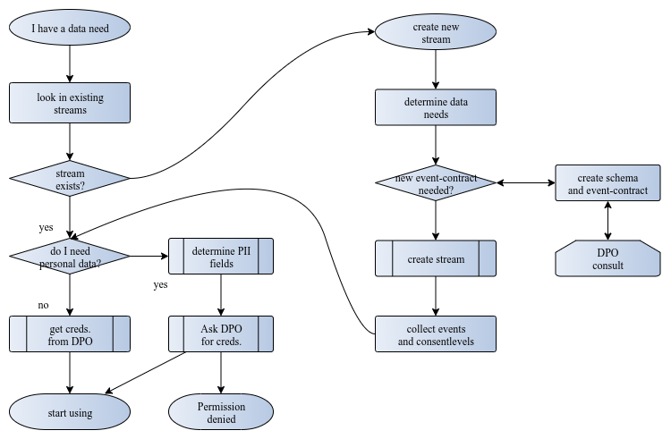

# Bringing STRM Privacy into your organization

In order to start using STRM Privacy in your organization you need to
organize the following:

## Who decides the shape and content of your event data?

The goal of STRM Privacy is to bring clarity into your event data
processing, in both the shape and rules that govern the events, as well
as who uses what data.

Your organization needs to decide who is reponsible for deciding or
picking [schemas](/concepts/schemas-and-contracts.md#schema) (the
*shape* of the events) as well as who is responsible for their content
(via the [*event
contracts*](/concepts/schemas-and-contracts.md#contract)). This does
not have to be organization wide of course, but it’s advisable that
there is clear ownership for each event stream.

The [*schema*](/concepts/schemas-and-contracts.md#schema) determines
what attributes exist on a certain type of event; think `url`,
`session-id`, `customer-id`, `address`, `article-nr`, …

The [*event contract*](/concepts/schemas-and-contracts.md#contract)
determines the rules that govern these attributes:

-   what content makes an attribute valid or invalid?

-   which attribute indicates that events belong to a same entity?

-   which attributes contain personal data, and what consent needs to be
    given to use the attribute.

Each event *must* conform to a certain schema, extra fields or missing
mandatory fields will not be accepted by STRM Privacy. We think that
it’s generally a *good idea to have data scientists or analytics
personnel define these schemas*, and not the teams that are responsible
for sending the events.

Note that STRM Privacy has predefined public schemas that can be used by
every STRM Privacy customer, but it’s also quite easy to define your own
event schemas.

STRM Privacy schemas *must contain a
[`strmMeta`](/concepts/strm-meta.md)* section that defines

-   the consent-level(s) given by the data-owner for the processing of
    this event

-   a field that allows retrieval of the encryption key for personal
    data attributes

-   a few other of less fundamental importance.

## Determine the consent levels for handling personal data in your company {#consent-levels}

Event contents are governed by [*event
contracts*](/concepts/schemas-and-contracts.md#contract). These define
among other things which attributes of an event contain personal data.

Your organization has to determine which attributes of an event schema
contain personal data, and how these attributes map to the consent
levels that have been chosen by your organization. These decisions are
of a non-technical nature, and correspond closely to the rules around
*cookie consent*.

_Example 1. Example consent levels_

<i>level 0</i>

The data owner does not allow any processing of personal data. STRM
Privacy removes the *personal* aspect of personal data attributes by
encryption, and in this case, the encryption key will not be used for
decryption, and will be discarded after 24 hours. This means that we can
still use these event data for some aggregated information (like a
customer journey) but we’ll never be able to relate these events to a
certain person.

<i>level 1</i>

Customer allows recommendations based on an average over all customers

<i>level 2</i>

Customer allows personalized recommendations

<i>level 3</i>  

Customer allows personalized email marketing

<i>level 4</i>  

Customer allows contact by phone

This is just an example; STRM Privacy allows very fine grained consent
tables.

## Collect the data owners consent level(s)

**Every event** in STRM Privacy has consent level(s) added inside it,
that define what consent was given by the data owner for this event.
Typically, these will be the same for a whole sequence of events, but as
far as STRM Privacy is concerned every event is handled individually.

Your organization has to set up the mechanism whereby data owner consent
choices are entered into the system that generates the events. For
events that originate in a web-browser this can generally be done from
the consent *cookie*, but for events that originate somewhere in a
back-end system, another mechanism has to be created.

## Create a stream and associated credentials

Once you’ve determined all of the above, you are ready to start sending
events to STRM Privacy. You need

1.  Software that collects events and creates a STRM Privacy compatible
    event.

2.  a STRM Privacy billing account

3.  a STRM Privacy *stream* definition

4.  associated credentials

We provide [various drivers](/quickstart/full-example.md) to send data
into STRM Privacy. None of these drivers are *mandatory*, it’s quite
doable to write your own (see [here](/quickstart/sending-curl.md)).
All the software for interacting with STRM Privacy is common
open-source, there’s no magic and no vendor lock-in!

## Extract events

For further use of the events in your organization you have two options:

-   periodically (for instance once a minute) send events to a [cloud bucket](/quickstart/receiving-s3.md). Fully encrypted streams will
    be ok to use for *everyone* in your organization, they no longer
    contain personal data.

-   If you have more realtime requirements, you can export to a [Kafka cluster](/quickstart/exporting-kafka.md), and use a standard Kafka
    consumer to consume events in real time. Typical end-to-end latency
    is configurable, but can easily be brought under 1 second.

## Decrypted streams

Assume a part of your organization requires personal data. In that case
one needs to

1.  create a decrypted stream with the required consent levels.

2.  create (batch)exporters for these streams

3.  provide those that have a need for these data with necessary
    credentials.

4.  start processing

## Flowchart for using data with STRM Privacy

Below is a flow chart for those in an organization that want to start
using certain events with STRM Privacy.

