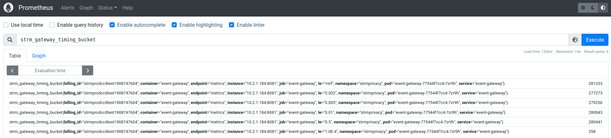

[cli]: https://github.com/strmprivacy/cli
[github]: https://github.com/strmprivacy/data-plane-helm-chart/tree/master
[batch-exporter]: https://docs.strmprivacy.io/docs/latest/quickstart/batch-exporter
[exporting-keys]: https://docs.strmprivacy.io/docs/latest/quickstart/exporting-keys/
[data-connector]: https://docs.strmprivacy.io/docs/latest/quickstart/batch-exporter/#creating-a-data-connector
[ovh-ingress]: https://docs.ovh.com/au/en/kubernetes/installing-nginx-ingress/
[profile]: https://console.strmprivacy.io/upgrading
[values]: https://console.strmprivacy.io/installation/configuration
[confluent]: https://docs.confluent.io/platform/current/quickstart/ce-docker-quickstart.html#cp-quickstart-step-1
[console]: https://console.strmprivacy.io
[minio-mc]: https://docs.min.io/docs/minio-client-complete-guide.html
[port-forward]: https://kubernetes.io/docs/tasks/access-application-cluster/port-forward-access-application-cluster/
[tink]: https://github.com/google/tink
[avro-json]: https://avro.apache.org/docs/current/spec.html#json_encoding
[helm-gcs]: https://github.com/hayorov/helm-gcs
[kctx]: https://github.com/ahmetb/kubectx
[telepresence]: https://www.telepresence.io/

This hands-on sessions shows how to get up-and-running with your Customer Cloud Deployment, and verify its
functionality.

## Make sure you are on a 'Self Hosted' subscription
Your [STRM profile page][profile] should show: "Current subscription: Self hosted". Get in touch with your STRM
representative if you're on a Free or Business subscription.

Once you're on a self hosted subscription, you can proceed with this quickstart guide.

## Install the following tools

* [`strm`][cli]: the STRM Privacy cli. You need this to control your STRM resources, and to simulate some events.
* [`kubectl`](https://kubernetes.io/docs/tasks/tools/): the Kubernetes cli.
* [`helm`](http://helm.sh): This Kubernetes package manager is used for installing (and upgrading) your STRM
  customer data plane. Also install the [helm-gcs plugin][helm-gcs]
* [`k9s`](https://github.com/derailed/k9s) (optional): This _textual user interface_ offers a very convenient way to
  interact with kubernetes clusters.
* [`kubectx`][kctx] and [`kubens`][kctx] (optional): Very useful tools to switch the default
  kubernetes context and namespace.
* [`minio mc`][minio-mc] (optional): A useful tool to interact with S3 compatible object storage (including S3 by AWS
  itself).

## Install the STRM customer data plane

### Preparation

1. Make sure you have active kubernetes credentials to a cluster: `kubectl get nodes` should show the nodes of your
   cluster.
1. Create a namespace `strmprivacy` (`kubectl create namespace strmprivacy`) and set that as default (`kubens strmprivacy`).
1. Download the credentials file `values.yaml` through [the STRM Privacy Console][values].

The `values.yaml` file should be similar to this:

```yaml
  registry:
    imagePullSecret: "ewogIC...."

  license:
    installationId: "f4cea...."
    installationClientId: "ins-...."
    installationClientSecret: "tii...."

  kafka:
    enabled: true

  redis:
    enabled: true

  postgresql:
    enabled: true
```

:::note
Add the [gcs plugin][helm-gcs] to helm `helm plugin install https://github.com/hayorov/helm-gcs.git`
:::

## Install the Helm chart

**add the helm repo**

    helm repo add strmrepo gs://stream-machine-production-helm-chart/data-plane

Install _all_ the STRM components inside the `strmprivacy` namespace.

    helm install strmprivacy strmrepo/strm --values values.yaml

`kubectl get pods --watch` or `k9s` provides nice feedback to see how the
installation is progressing. We see that some supporting infrastructure like Redis, Postgresql and Kafka are also
installed. The creation of these components can be disabled, in which case configuration to the actual components will
have to be added to the Helm chart.

:::note
During creating, you'll see Error states on the event-gateway pods for instance. This is _nominal_ because it will fail
to connect to Redis, which is still being deployed. Once Redis is healthy, you'll see the event-gateway status turn
healthy
:::

:::note Create in a different namespace
Add `namespace: <your-namespace>` to the `values.yaml` file.
The namespace needs to be created *manually* with `kubectl create namespace <your-namespace>`.
With every `helm` command you should use the option `--values values.yaml`
:::

## Interacting with the CCD cluster {#interacting}

### Setup port forwarding

To interact with the `event-gateway` and `web-socket` for testing purposes we will set up Kubernetes port-forwarding.

To add a forwarding port to a deployment either use `k9s` and press `shift+f` on the deployments for the `event-gateway` and the `web-socket` or do the following:

Run the next commands in separate shells, and keep them running:
```bash
kubectl port-forward deployment/event-gateway 8080:8080 &
kubectl port-forward deployment/web-socket 8082:8080 &
```

In a production setting you obviously would not use port-forwarding. Typically one would
* add a Kubernetes `ingress` in front of the `event-gateway` service. This creates a load balancer in the infrastructure
  that will allow https access to the event-gateway. Make sure the load balancer is capable of handling http/2 otherwise
  latency and throughput will suffer.
* communicate directly with the `event-gateway` service. This would only work if your events are being sent from within
  the same Kubernetes cluster.

### Streams

First create two streams.

    strm create stream test --save
    strm create stream --derived-from test --levels 2 --save

Because you've create a derived stream (named `test-2` by default) we should be able to see a decrypter deployment:
```bash
kubectl get deployments.apps  -l app=decrypter-v2
```

    NAME                                             READY   UP-TO-DATE   AVAILABLE   AGE
    decrypter-a268aea6-4b5b-4241-b833-9a84f4f44bc4   1/1     1            1           93m

You could use `kubectl describe deployment decrypter...` to see the annotations on the deployment, and see that it is
indeed processing your `test-2` stream. The _name_ of the decrypter deployment is just `decrypter-<random uuid>` and can
not be chosen by anyone.


#### Sending events with the cli

To simulate events with our cli, the `events-api-url` parameter must be set to the port exposed via the port-forward
(the url can also be set in the strm config file (`strm context config`).

```bash
strm simulate random-events test --events-api-url=http://localhost:8080/event --interval 5
```
    Sent 874 events
    Sent 1809 events
    Sent 2726 events
    ...

#### Listening on the web-socket via the cli
```bash
strm listen web-socket test --web-socket-url ws://localhost:8082/ws
```

    {"strmMeta": {"eventContractRef": "strmprivacy/example/1.3.0", "nonce": -447993628, "timestamp": 1652181230883, "keyLink": "7573fc76-ae34-4c49-a3fd-d552b677ffa1", "billingId": "strmprodccdtest1908747604", "consentLevels": [0, 1, 2, 3]}, "uniqueIdentifier": "AQAsswoVM2q6Q6+eeTb5Qe61xBHTaAZZMVCh+vDf", "consistentValue": "AQAsswoPYW8+VGwOZvfh+FmSEh2UoVTRNkNWlyQOpwA=", "someSensitiveValue": "AQAsswpQCKDPUYNls3hy13IllL5vd4bz/X3rEsBI0TEV", "notSensitiveValue": "not-sensitive-64"}
    {"strmMeta": {"eventContractRef": "strmprivacy/example/1.3.0", "nonce": -45323834, "timestamp": 1652181230893, "keyLink": "9ced67fc-9227-4fb2-846b-1eed521db941", "billingId": "strmprodccdtest1908747604", "consentLevels": [0, 1, 2]}, "uniqueIdentifier": "AWzkJjeWufjZehXNpWLUQ63CG1O8jxCU6MOd3Seo", "consistentValue": "AWzkJjd3cB+36sCrtT6va3YLjCa5qw55Iy5/HevIcVU=", "someSensitiveValue": "AWzkJjcsrjNHbZCAjlEYCBdlpOVK8+eXIx6BSBDxH8VQ", "notSensitiveValue": "not-sensitive-42"}

Or a derived stream
```bash
strm listen web-socket test-2 --web-socket-url ws://localhost:8082/ws
```
    {"strmMeta": {"eventContractRef": "strmprivacy/example/1.3.0", "nonce": -1742873135, "timestamp": 1652181297380, "keyLink": "556c1be7-4332-4058-9d36-5e3e5a66e121", "billingId": "strmprodccdtest1908747604", "consentLevels": [0, 1, 2]}, "uniqueIdentifier": "unique-81", "consistentValue": "session-922", "someSensitiveValue": "AQM0jlnxbeNZSJzvJWLpnMjyYET1Jb1Yz+5yZVB5i6Dq", "notSensitiveValue": "not-sensitive-78"}


### Consume from Kafka
Install the [Confluent client tools][confluent]. You don't have to start Confluent, you only need to add the `bin` directory
of the unpacked confluent tar file  to your `$PATH`.

You need [the `strm` cli][cli] of _at least version 2.1.0_ in order to find the Kafka topic in the streams information

In order to consume from Kafka with your development computer, you'll need to set up [telepresence][telepresence], which
sort of includes your computer within the Kubernetes dns.

    telepresence connect
```
    Launching Telepresence Root Daemon
    Launching Telepresence User Daemon
    Connected to context kubernetes-admin@...
```


    strm list streams
```
 STREAM   DERIVED   CONSENT LEVEL TYPE   CONSENT LEVELS   ENABLED   KAFKA TOPIC

 test     false                          []               true      stream-e379c8e5-0e25-4b95-b1f4-c5ceb20a233f
 test-2   true      CUMULATIVE           [2]              true      stream-f704507b-1e88-4464-98e0-b7cfa501ec75
```

Then pass this topic to the kafka consumer:
```bash
kafka-avro-console-consumer     \
  --bootstrap-server kafka.strmprivacy:9092     \
  --topic stream-e379c8e5-0e25-4b95-b1f4-c5ceb20a233f     \
  --property schema.registry.url=http://confluent-schema-proxy.strmprivacy/confluent     \
  --property print.key=true     \
  --key-deserializer="org.apache.kafka.common.serialization.StringDeserializer"
```
    1867d5ad-f1fb-4faa-af98-f863a4f9e3e4    {"strmMeta":{"eventContractRef":"strmprivacy/example/1.3.0","nonce":{"int":-810110116},"timestamp":{"long":1652181101870},"keyLink":{"string":"1867d5ad-f1fb-4faa-af98-f863a4f9e3e4"},"billingId":{"string":"strmprodccdtest1908747604"},"consentLevels":[]},"uniqueIdentifier":{"string":"AR5VVyfQsta+D1XDKcPiR0sC1oE3yy301W2FMVJ9"},"consistentValue":"AR5VVydsWvZG+FkvlOFEUZCvlFY4rSpVHs1njIE8tg==","someSensitiveValue":{"string":"AR5VVyfO8S3djArRlS6ZaI4oefWUjEt9XRnT/f2r6vc="},"notSensitiveValue":{"string":"not-sensitive-84"}}
    5afc9c0a-de67-4e38-bd0a-66640f4349c7    {"strmMeta":{"eventContractRef":"strmprivacy/example/1.3.0","nonce":{"int":1699175479},"timestamp":{"long":1652181101896},"keyLink":{"string":"5afc9c0a-de67-4e38-bd0a-66640f4349c7"},"billingId":{"string":"strmprodccdtest1908747604"},"consentLevels":[0,1,2,3]},"uniqueIdentifier":{"string":"ASotb1YzBuuBBM981rLIzQd/EZA7Em7dxyaBg7vE"},"consistentValue":"ASotb1bYf1G/2ye4h6ELE4hlkVGZGKSt3LQe0AnZU+k=","someSensitiveValue":{"string":"ASotb1bb51OCfM9HdCqcAjTLtXqK67EuBQicTpNzIvv/"},"notSensitiveValue":{"string":"not-sensitive-95"}}

:::note
We can't yet use an _existing Confluent Schema Registry_ in your infrastructure. This is on our roadmap.
:::

:::note Avro-Json
The _json_ from the `kafka-avro-console-consumer` is the [Avro json format][avro-json] which includes a type attribute for nullable types for instance

    "notSensitiveValue":{"string":"not-sensitive-84"}
Our `web-socket` debugging output uses the less verbose `null` or `some string` in the json, i.e.

    "notSensitiveValue": "not-sensitive-84"
:::

### Exporting to an S3 bucket

Create the S3 bucket and the associated `data connector`. See [here][data-connector] for details
about data connector configuration.

    strm create data-connector s3 s3-connector --credentials-file=...

    strm create batch-exporter test-2 \
      --data-connector s3-connector \
      --path-prefix ccd-events-demo \
      --include-existing-events

You should see a newly-created batch-exporter deployment:
```bash
kubectl get deployments.apps  -l app=batch-exporter
```
    NAME                                                  READY   UP-TO-DATE   AVAILABLE   AGE
    batch-exporter-c726bbff-2b68-4438-ac0d-ee877aa4dabf   1/1     1            1           2m49s

If you're sending data, you should see files in your s3 bucket quickly:
```bash
aws s3 ls s3://stream-machine-export-demo/ccd-events-demo/
```
    2022-05-10 15:09:21          0 .strm_test_a6c5d566-f851-4778-a7fb-5d39d8958aa4.jsonl
    2022-05-10 15:10:02     131735 2022-05-10T13:10:00-stream-4a35419c-2daf-43ba-8683-7663a0874a35---0-1-2-3-4.jsonl
    2022-05-10 15:11:01     196628 2022-05-10T13:11:00-stream-4a35419c-2daf-43ba-8683-7663a0874a35---0-1-2-3-4.jsonl
    2022-05-10 15:12:01     181281 2022-05-10T13:12:00-stream-4a35419c-2daf-43ba-8683-7663a0874a35---0-1-2-3-4.jsonl
    2022-05-10 15:13:01     202094 2022-05-10T13:13:00-stream-4a35419c-2daf-43ba-8683-7663a0874a35---0-1-2-3-4.jsonl

Looking inside one of them:
```bash
aws s3 cp s3://stream-machine-export-demo/ccd-events-demo/2022-05-10T13:12:00-stream-4a35419c-2daf-43ba-8683-7663a0874a35---0-1-2-3-4.jsonl - | head -1 | jq
```
    {
      "strmMeta": {
        "eventContractRef": "strmprivacy/example/1.3.0",
        "nonce": -1616102758,
        "timestamp": 1652188259519,
        "keyLink": "9e55c3dc-16a3-422b-91e7-b27dffd385e6",
        "billingId": "strmprodccdtest1908747604",
        "consentLevels": [
          0,
          1,
          2
        ]
      },
      "uniqueIdentifier": "unique-3",
      "consistentValue": "session-453",
      "someSensitiveValue": "AXWnGm/OjbB42PEJuXLwqZX7sRCdSlLInDpNOnJlBxiJ",
      "notSensitiveValue": "not-sensitive-6"
    }

### Exporting to an S3 compatible bucket

It is possible to export data to any S3 compatible bucket. For more information, see our 
[Batch Exporter quickstart][batch-exporter].

### Exporting encryption keys

If you need to export the encryption keys, create a batch exporter with the `export-keys` option:

```bash
strm create batch-exporter test --export-keys --data-connector s3-connector --include-existing-events --path-prefix ccd-demo-keys
```

For more information, see our [quickstart on exporting keys][exporting-keys].

### Python Example

[python]: https://docs.strmprivacy.io/docs/latest/quickstart/full-example/

The [Python example][python] needs a small modification in order to work. In the `client_builder.py` file change the
`config` for

        config = ClientConfig(log_level=logging.DEBUG,
                              gateway_protocol="http",
                              gateway_host="localhost:8080")

[sasl-plain]: https://docs.confluent.io/platform/current/kafka/authentication_sasl/authentication_sasl_plain.html
[kafka-ssl]: https://docs.confluent.io/platform/current/kafka/encryption.html#kafka-ssl-encryption
[keys-certs]: https://docs.confluent.io/platform/current/security/security_tutorial.html#generating-keys-certs

## Using an existing Kafka cluster over TLS, with SASL/Plain authentication{#tls-sasl-plain}

This hands-on sessions shows how to get up-and-running with your Customer Cloud Deployment using an _authenticated Kafka
Cluster_ that uses [SASL/PLAIN over TLS][sasl-plain] authentication.

It's probably a good idea to first run the getting started with the unauthenicated demo Kafka detailed in the sections above to
make sure you have all the tools configured correctly and understand how it should work.


### The TLS trust store.

In order for our Kafka clients to interact with your Kafka brokers over TLS, they'll have to trust them. This goes via
[a trust store][kafka-ssl]. A truststore is an encrypted file that the Kafka clients have to use in order to trust the
broker. You'll have to generate one as described in the [Confluent documentation][keys-certs], and put the generated
value in a Kubernetes secret. The trust store has a password to protect it. You must add this password to the Kubernetes
secret also.


    kubectl create secret generic client-truststore-jks \
      --from-file=client.truststore.jks=<your-truststore-jks-file> \
      --from-literal=truststore.password=<your-truststore-password>

:::note
don't change the `client.truststore.jks` and `truststore.password` keys. These are being used by the various Kubernetes
deployments to retrieve the entities.
:::

So once this secret exists and has been made available to the Kafka clients inside the STRM ecosystem, these clients can
communicate securely with the Kafka brokers.

### Authentication
Currently we only support [SASL/PLAIN][sasl-plain] authentication; this is a simple username/password scheme, where the
Kafka cluster has a list of pairs that it accepts. The communication is _plain text_ but since the channel is TLS
encrypted, this can not be intercepted.

### `values.yaml`
The `values.yaml` file you download from the [console][console] adds a `kafka.enabled: true` override, so the helm chart
will actuall deploy a Kafka instance inside your k8s namespace. Make sure you have in your `values.yaml`

    kafka:
      enabled: false
      # you could have multiple separated with a comma
      bootstrapServers: <your-kafka-broker>:<port>

Configuring the credentials is done in two parts.

#### kafkaSecurityConfig

The top-level `kafkaSecurityConfig` section  defines how to configure the TLS connection

    kafkaSecurityConfig:
      enabled: true
      securityProtocol: "SASL_SSL"
      sslTruststoreSecretName: "client-truststore-jks" # use k8s secret name you created.

:::note
You can leave of the `sslTruststoreSecretName` if you used the default `client-truststore-jks` name for the secret.
:::

#### Authentication
The various parts of STRM that interact with Kafka all have to be given a principal name and password. This has to be done in
the individual Helm override sections. The `user/password` pairs have to be created in your Kafka broker configuration.
In the little sample below, I've added trivial identities for the various components. You could use the principal one for
every one of them, but they must be defined separately.

```
components:
  eventGateway:
    configuration:
      kafkaAuth:
        user: strm-event-gateway
        password: strmprivacy
  webSocket:
    configuration:
      kafkaAuth:
        user: strm-web-socket
        password: strmprivacy
  batchExportersAgent:
    configuration:
      kafkaAuth:
        user: strm-batch-exporter
        password: strmprivacy
  streamsAgent:
    configuration:
      kafkaAuth:
        user: strm-streams-agent
        password: strmprivacy
  esrProxy:
    configuration:
      kafkaAuth:
        user: strm-esr-proxy
        password: strmprivacy
  decrypterConfig:
    configuration:
      kafkaAuth:
        user: strm-decrypter
        password: strmprivacy
  batchExporterConfig:
    configuration:
      kafkaAuth:
        user: strm-batch-exporter
        password: strmprivacy
```

#### Authorization
We assume that once authorized, the entity has the permissions it needs. In case you have fine-grained authorization via
RBAC or ACLs on the Kafka cluster, the following permissions are required:

* `event-gateway` needs topic write rights to topics in the cluster whose name starts with `stream-` or `keys-` and a
  topic named `billing`
* `streams-agent` needs topic admin rights to create and delete and inspect topics. It will create topics whose name
  starts with `stream-` or `keys-`
* `web-socket` needs topic consume rights to topics starting with `stream-`.
* `batch-exporters-agent` needs topic consume rights to topics starting with `stream-` or `keys-`.
* `esr-proxy` needs topic consume rights to a topic named `billing`

### Installing
Once you have created the `values.yaml` as described above, you can

    helm install strmprivacy strmrepo/strm --values values.yaml

and follow along with the [Interacting with the CCD Cluster](#interacting) section.

#### Troubleshooting
It is _highly likely_ that this won't correctly in the first go. Setting up the TLS can go wrong in many ways, from the
trivial (missing secret), to the painful (reverse hostname verification doesn't work). The logging of deployments like
the `streams-agent` or the `event-gateway` will probably give a clue what's going on.

Troubleshooting with a Kafka test-client.

Use [this Kubernetes manifest](./assets/kafka-tls-client.yaml) to interact with the Kafka cluster.

Modify the `client.props` section to use your credentials (the truststore password and the principal username/password
pair)

```
  client.props: |
    security.protocol=SASL_SSL
    ssl.truststore.location=/tmp/truststore/client.truststore.jks
    ssl.truststore.password=strmprivacy
    sasl.mechanism=PLAIN
    sasl.jaas.config=org.apache.kafka.common.security.plain.PlainLoginModule required     username="strm-event-gateway"     password="strmprivacy";
```
:::note
make sure you keep the `sasl.jaas.config` one one line and don't forget the semi-colon at the end!
:::

You can now interact with the Kafka cluster from within the pod.

```
kubectl exec -ti kafka-tls-test-client-5f6d87ccfc-mfksl -- bash

kafka-topics.sh --bootstrap-server <your-bootstrap-server> --list \
     --command-config /tmp/client.props
__consumer_offsets
billing
keys-28a3152d-f6c8-4c52-8bd7-c587089938eb
keys-35bc9088-c41c-41de-b042-fa835a4cb3b1
stream-28a3152d-f6c8-4c52-8bd7-c587089938eb
stream-35bc9088-c41c-41de-b042-fa835a4cb3b1
stream-e00843bd-86c8-4b85-a1bd-b7b509fc6804
```


### Trying again

If you've made mistakes and want to start over:

1. `helm uninstall strmprivacy --namespace strmprivacy`
1. `kubectl delete ns strmprivacy` kills everything
   (including the k8s namespace). Don't forget to recreate the
   namespace afterwards.

[prometheus]: https://prometheus.io/
[prom-helm]: https://github.com/prometheus-community/helm-charts
[prom-sm]: https://github.com/prometheus-community/helm-charts/blob/main/charts/kube-prometheus-stack/templates/prometheus-operator/servicemonitor.yaml

## Monitoring the cluster via Prometheus
Most components of STRM Privacy expose [Prometheus][prometheus] metrics and we've included the [Prometheus Cluster
Operator][prom-helm] Helm chart. In order to define _scrape targets_ to Prometheus, we deploy  [Service
Monitors][prom-sm] that expose the metrics endpoints in the Event Gateway.

### the Prometheus server
Access the Prometheus server either via [telepresence][telepresence] or via a port-forward

    kubectl port-forward service/strmprivacy-kube-prometheu-prometheus 9090:9090&

You should see the Event Gateway in the [service discovery](http://localhost:9090/service-discovery)

* serviceMonitor/strmprivacy/event-gateway-envoy-service-monitor/0
* serviceMonitor/strmprivacy/event-gateway-service-monitor/0

and the [targets](http://localhost:9090/targets)


If you have the simulator running, you could have somewhat interesting timing data:




### Grafana
The CCD quickstart also includes a Grafana instance, that we can port-forward

    kubectl port-forward service/strmprivacy-grafana 4000:80&

Log in to [Grafana](http://localhost:4000/dashboards) with username `admin` and password `prom-operator` (the value of
the secret named `strmprivacy-grafana`).

I've added two panels for the very simple dashboard we show here:


