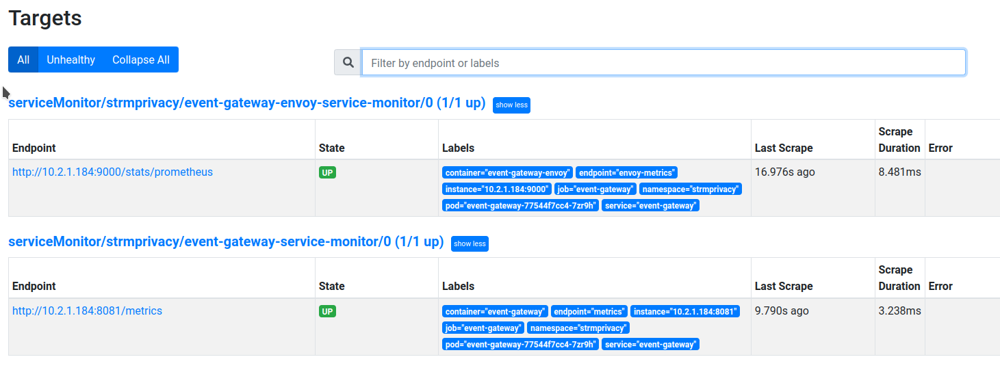
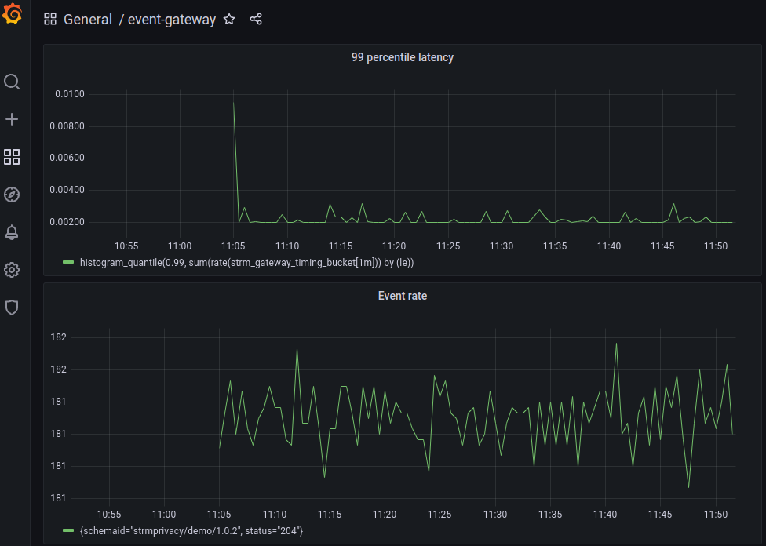

import CodeBlock from '@theme/CodeBlock';
import {ExternalCodeBlock} from '/full-example.js';

[sasl-plain]: https://docs.confluent.io/platform/current/kafka/authentication_sasl/authentication_sasl_plain.html
[kafka-ssl]: https://docs.confluent.io/platform/current/kafka/encryption.html#kafka-ssl-encryption
[keys-certs]: https://docs.confluent.io/platform/current/security/security_tutorial.html#generating-keys-certs

## Using an existing Kafka cluster over TLS, with SASL/Plain authentication{#tls-sasl-plain}

This hands-on session shows how to get up-and-running with your Customer Cloud Deployment using an _authenticated Kafka
Cluster_ that uses [SASL/PLAIN over TLS][sasl-plain] authentication.

It's probably a good idea to first run the getting started with the unauthenicated demo Kafka detailed in the sections above to
make sure you have all the tools configured correctly and understand how it should work.


### The TLS trust store

In order for our Kafka clients to interact with your Kafka brokers over TLS, they'll have to trust them. This goes via
[a trust store][kafka-ssl]. A truststore is an encrypted file that the Kafka clients have to use in order to trust the
broker. You'll have to generate one as described in the [Confluent documentation][keys-certs], and put the generated
value in a Kubernetes secret. The trust store has a password to protect it. You must add this password to the Kubernetes
secret also.


    kubectl create secret generic client-truststore-jks \
      --from-file=client.truststore.jks=<your-truststore-jks-file> \
      --from-literal=truststore.password=<your-truststore-password>

:::note
don't change the `client.truststore.jks` and `truststore.password` keys. These names are being used by the various Kubernetes
deployments to retrieve the entities.
:::

So once this secret exists and has been made available to the Kafka clients inside the STRM ecosystem, these clients can
communicate securely with the Kafka brokers.

### Authentication
Currently we only support [SASL/PLAIN][sasl-plain] authentication; this is a simple username/password scheme, where the
Kafka cluster has a list of pairs that it accepts. The communication is _plain text_ but since the channel is TLS
encrypted, this can not be intercepted.

### `values.yaml`
The `values.yaml` file you download from the [console][console] adds a `kafka.enabled: true` override, so the helm chart
will actuall deploy a Kafka instance inside your k8s namespace. Make sure you have in your `values.yaml`

    kafka:
      enabled: false
      # you could have multiple separated with a comma
      bootstrapServers: <your-kafka-broker>:<port>

Configuring the credentials is done in two parts.

#### kafkaSecurityConfig

The top-level `kafkaSecurityConfig` section  defines how to configure the TLS connection

    kafkaSecurityConfig:
      enabled: true
      securityProtocol: "SASL_SSL"
      sslTruststoreSecretName: "client-truststore-jks" # use k8s secret name you created.

:::note
You can leave of the `sslTruststoreSecretName` if you used the default `client-truststore-jks` name for the secret.
:::

#### Authentication
The various parts of STRM that interact with Kafka all have to be given a principal name and password. This has to be done in
the individual Helm override sections. The `user/password` pairs have to be created in your Kafka broker configuration.
In the little sample below, I've added trivial identities for the various components. You could use the principal one for
every one of them, but they must be defined separately.

```
components:
  eventGateway:
    configuration:
      kafkaAuth:
        user: strm-event-gateway
        password: strmprivacy
  webSocket:
    configuration:
      kafkaAuth:
        user: strm-web-socket
        password: strmprivacy
  batchExportersAgent:
    configuration:
      kafkaAuth:
        user: strm-batch-exporter
        password: strmprivacy
  streamsAgent:
    configuration:
      kafkaAuth:
        user: strm-streams-agent
        password: strmprivacy
  esrProxy:
    configuration:
      kafkaAuth:
        user: strm-esr-proxy
        password: strmprivacy
  decrypterConfig:
    configuration:
      kafkaAuth:
        user: strm-decrypter
        password: strmprivacy
  batchExporterConfig:
    configuration:
      kafkaAuth:
        user: strm-batch-exporter
        password: strmprivacy
```

#### Authorization
We assume that once authorized, the entity has the permissions it needs. In case you have fine-grained authorization via
RBAC or ACLs on the Kafka cluster, the following permissions are required:

* `event-gateway` needs topic write rights to topics in the cluster whose name starts with `stream-` or `keys-` and a
  topic named `billing`
* `streams-agent` needs topic admin rights to create and delete and inspect topics. It will create topics whose name
  starts with `stream-` or `keys-`
* `web-socket` needs topic consume rights to topics starting with `stream-`.
* `batch-exporters-agent` needs topic consume rights to topics starting with `stream-` or `keys-`.
* `esr-proxy` needs topic consume rights to a topic named `billing`

### Installing
Once you have created the `values.yaml` as described above, you can

    helm install strmprivacy strmrepo/strm --values values.yaml

and follow along with the [Interacting with the CCD Cluster](#interacting) section.

#### Troubleshooting
It is _highly likely_ that this won't correctly in the first go. Setting up the TLS can go wrong in many ways, from the
trivial (missing secret), to the painful (reverse hostname verification doesn't work). The logging of deployments like
the `streams-agent` or the `event-gateway` will probably give a clue what's going on.

Troubleshooting with a Kafka test-client.

Use this Kubernetes manifest to interact with the Kafka cluster.

[//]: # (TODO: create live links to code)
<ExternalCodeBlock
url="https://raw.githubusercontent.com/strmprivacy/data-plane-helm-chart/master/test-utils/kafka-tls-client.yaml"
title="kafka-tls-client.yaml"
lang="yaml"
/>


Modify the `client.props` section to use your credentials (the truststore password and the principal username/password
pair)

```
  client.props: |
    security.protocol=SASL_SSL
    ssl.truststore.location=/tmp/truststore/client.truststore.jks
    ssl.truststore.password=strmprivacy
    sasl.mechanism=PLAIN
    sasl.jaas.config=org.apache.kafka.common.security.plain.PlainLoginModule required     username="strm-event-gateway"     password="strmprivacy";
```
:::note
make sure you keep the `sasl.jaas.config` on one line and don't forget the semi-colon at the end!
:::

You can now interact with the Kafka cluster from within the pod.

```
kubectl apply -f kafka-tls-test-client
# use tab-completion to get the name of the pod
kubectl exec -ti kafka-tls-test-client-... -- bash

kafka-topics.sh --bootstrap-server <your-bootstrap-server> --list \
     --command-config /tmp/client.props
__consumer_offsets
billing
keys-28a3152d-f6c8-4c52-8bd7-c587089938eb
keys-35bc9088-c41c-41de-b042-fa835a4cb3b1
stream-28a3152d-f6c8-4c52-8bd7-c587089938eb
stream-35bc9088-c41c-41de-b042-fa835a4cb3b1
stream-e00843bd-86c8-4b85-a1bd-b7b509fc6804
```


### Trying again

If you've made mistakes and want to start over:

1. `helm uninstall strmprivacy --namespace strmprivacy`
1. `kubectl delete ns strmprivacy` kills everything
   (including the k8s namespace). Don't forget to recreate the
   namespace afterwards.

[prometheus]: https://prometheus.io/
[prom-helm]: https://github.com/prometheus-community/helm-charts
[prom-sm]: https://github.com/prometheus-community/helm-charts/blob/main/charts/kube-prometheus-stack/templates/prometheus-operator/servicemonitor.yaml

## Monitoring the cluster via Prometheus
Most components of STRM Privacy expose [Prometheus][prometheus] metrics and we've included the [Prometheus Cluster
Operator][prom-helm] Helm chart. In order to define _scrape targets_ to Prometheus, we deploy  [Service
Monitors][prom-sm] that expose the metrics endpoints in the Event Gateway.

### the Prometheus server
Access the Prometheus server either via [telepresence][telepresence] or via a port-forward

    kubectl port-forward service/strmprivacy-kube-prometheu-prometheus 9090:9090&

You should see the Event Gateway in the [service discovery](http://localhost:9090/service-discovery)

* serviceMonitor/strmprivacy/event-gateway-envoy-service-monitor/0
* serviceMonitor/strmprivacy/event-gateway-service-monitor/0

and the [targets](http://localhost:9090/targets)



If you have the simulator running, you could have somewhat interesting timing data:


### Grafana
The CCD quickstart also includes a Grafana instance, that we can port-forward

    kubectl port-forward service/strmprivacy-grafana 4000:80&

Log in to [Grafana](http://localhost:4000/dashboards) with username `admin` and password `prom-operator` (the value of
the secret named `strmprivacy-grafana`).

I've added two panels for the very simple dashboard we show here:




