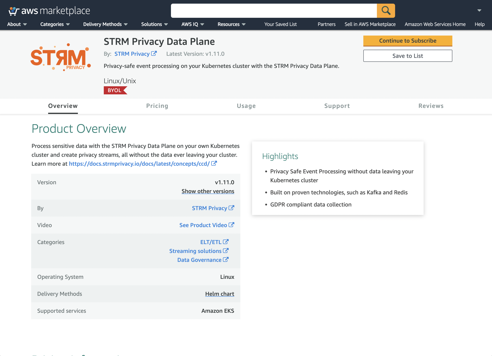

This section describes how to get up and running with a Customer Cloud Deployment through the AWS Marketplace.

:::note
We currently do not support unified billing through your AWS invoice. This is on our roadmap for our AWS Marketplace
offering.
:::

## Step 1: Follow along with the general steps for Customer Cloud Deployment

Before you can launch your AWS Marketplace STRM Privacy Installation, you need to follow along
with [step 1](./self-hosted.md#step1) and [step 2](./self-hosted.md#step2)
from the general steps section.

## Step 2: Setup a Kubernetes cluster with AWS EKS

One of the pre-requisites for the STRM Privacy Data Plane is an operational Kubernetes cluster. If you don't have an EKS
cluster yet, please follow the instructions on how to setup an EKS cluster in
the [AWS EKS getting started guide](https://docs.aws.amazon.com/eks/latest/userguide/create-cluster.html).

## Step 3: Subscribe to the STRM Privacy Data Plane

Navigate to the [STRM Privacy AWS Marketplace](https://aws.amazon.com/marketplace/pp/prodview-2ekyuezbwmiak) listing and
follow the following steps.



1. Click `Continue to Subscribe`, follow the instructions and start your subscription
2. Configure the STRM Privacy Data Plane:
    1. If multiple fulfillment options are presented, choose `Helm chart`
    2. Choose the latest version
3. Click `Continue to launch`
    1. Currently, the only supported _launch target_ is EKS (Amazon Elastic Kubernetes Service).
    2. Follow _Step 1_ of the launch instructions, please note the remarks below.
    
    :::note
    Before you can create an IAM Service Account with `eksctl`, an IAM OIDC provider must exist for your cluster. To do
    so, run:
    ```bash
    eksctl utils associate-iam-oidc-provider \
       --cluster <CLUSTER_NAME> \
       --region <CLUSTER_REGION> \
       --approve
    ```
    :::
    
    :::important
    The `eksctl` command in the launch instructions is incorrect, it is missing the policies that should be attached to
    the service account. The correct command is:
    ```bash
    eksctl create iamserviceaccount \
       --name <SERVICE_ACCOUNT_NAME> \
       --namespace strmprivacy \
       --cluster <CLUSTER_NAME> \
       --override-existing-serviceaccounts \
       --attach-policy-arn arn:aws:iam::aws:policy/AWSMarketplaceMeteringFullAccess \
       --attach-policy-arn arn:aws:iam::aws:policy/AWSMarketplaceMeteringRegisterUsage \
       --attach-policy-arn arn:aws:iam::aws:policy/service-role/AWSLicenseManagerConsumptionPolicy \
       --approve
    ```
    :::
4. Follow _Step 2_ of the launch instructions, making sure to replace the values in the `helm install` command with
   the values specific for your installation, which can be found in
   your [installation configuration](https://console.strmprivacy.io/installation/configuration).
   :::note
   If you plan to use a `values.yaml` instead of the inline Helm values (with `--set`):
   1. make sure to set the `license.installationType` to `AWS_MARKETPLACE`
   2. the `registry.imagePullSecret` can be omitted / left blank, as this is facilitated by your AWS Marketplace
   deployment
   :::

After these steps, you should end up with a namespace `strmprivacy` with, by default, [all components](./index.md#components) enabled. If you
wish otherwise, you can edit the `values.yaml` to match your needs.

### Using managed pre-requisites for the Data Plane

As the STRM Privacy Data Plane depends on Kafka, Redis and/or a Postgres Database, you should only use the embedded
instances of these pre-requisites to deploy your initial version. For production purposes, we recommend to use managed
instances.

#### Purpose of using managed instances

The subcharts for Kafka, Redis and PostgreSQL that are included in the STRM Privacy Data Plane Helm Chart are not meant
for production purposes, as they have not been configured as such. Furthermore, not all Kubernetes Clusters fulfill the
pre-requisites for this (e.g. support for persistent storage). The more convenient route here, is to use managed
instances of the pre-requisites for your Data Plane. The following sections discuss how to set up these managed
instances.

#### AWS RDS for PostgreSQL

To be able to run Batch Jobs, a PostgreSQL database is required. Please follow the steps from
the [AWS RDS for PostgreSQL guide](https://docs.aws.amazon.com/AmazonRDS/latest/UserGuide/CHAP_GettingStarted.CreatingConnecting.PostgreSQL.html)
, in order to setup a PostgreSQL database for your STRM Privacy Data Plane. Make sure to implement the best practices to
backup and restore data at any point in time as
described [here](https://docs.aws.amazon.com/AmazonRDS/latest/UserGuide/CHAP_CommonTasks.BackupRestore.html). General
remarks considering the database:

- Create a separate user (following
  the [principle of least privilege](https://en.wikipedia.org/wiki/Principle_of_least_privilege)) with read and write
  access rights to the database. Set the credentials in the `values.yaml` for the PostgreSQL user.
- Data usage will increase over time, therefore, it is wise to
  enable [AWS RDS Storage Autoscaling](https://docs.aws.amazon.com/AmazonRDS/latest/UserGuide/USER_PIOPS.StorageTypes.html)
  to prevent manual interventions.

#### AWS MSK for Apache Kafka

To be able to run any streaming tasks, a Kafka (or Kafka API compatible) cluster is required. Please follow the steps
from the [AWS MSK for Apache Kafka guide](https://docs.aws.amazon.com/msk/latest/developerguide/create-cluster.html) to
setup a managed Kafka cluster in your AWS account. Take note of the private bootstrap servers (and
possibly [credentials](./authenticated.md)) and set the value in the `values.yaml`.

#### AWS ElastiCache for Redis

To be able to run any streaming tasks, a Redis (or Redis API compatible) deployment is required. Please follow the steps
from
the [AWS ElastiCache for Redis guide](https://docs.aws.amazon.com/AmazonElastiCache/latest/red-ug/GettingStarted.html)
to setup a managed Redis deployment. Take note of the endpoint (and
possibly credentials) and set the value in the `values.yaml`.

## Wrap-up

You've installed a STRM Privacy Data Plane via the AWS Marketplace. If you have had any issues during your
installation, please let us know, or create a pull request on GitHub to improve these docs.

Now that you are done with the setup, follow the docs on [how to interact with your cluster](./interacting.md) to start
using it.
